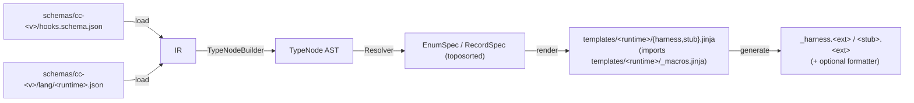

# Contributing

## Regenerating scaffolds from source

The README's Quick Start covers downloading pre-built scaffolds. If you're a contributor (or just
inspecting the pipeline), you can regenerate them from a checked-out tag instead — both paths deliver
identical output because generation is a pure function of committed source (`schemas/` +
`templates/` + codegen).

Check out the matching tag and run the generator:

```sh
git clone gh:jonasdawson/cc-flyrig && cd cc-flyrig
git checkout cc-<your-version>
pip install -e .
npm install 
python -m cc_flyrig.codegen generate --cc-version <your-version> --runtime all
```

`--runtime all` generates scaffolds for every runtime that has a template set. Pass a single name
(`--runtime python`, `--runtime typescript`) to generate just one. A runtime whose toolchain is
missing (e.g. `esbuild` when `npm install` hasn't run) is skipped with a note and a nonzero exit,
so the others still generate.

Your new folders land in `scaffolds/<language>/cc-<your-version>/`. Copy the event you want into
`.claude/hooks/` exactly as in the Quick Start.

The rolling window of committed scaffolds in `main` is an ergonomics choice for the browse-and-copy
Quick Start — every version is recoverable from its tag. At this initial public release the window
is a single version (`2.1.201`) rather than an actively rotated one or two; it starts rotating again
as new Claude Code versions are captured and released.

> The README's download shortcut assumes the hook contract didn't actually change in your version.
> To verify that by capturing real payloads from your Claude Code and reconciling the schema, 
> see "Contributing a capture/schema update" below. If you confirm a real change, I'd love to get your
> contribution!

## Contributing a capture/schema update for a new CC version

Running live capture needs a real, authenticated `claude` session (see
[capture_harness/README.md](capture_harness/README.md)'s prerequisites). If you have a Claude subscription as well as Claude Code and `tmux` on your own machine, you
can verify or re-baseline a CC version yourself and submit the result as a PR.

The steps are exactly the re-baseline workflow already documented in
[capture_harness/README.md](capture_harness/README.md#workflows):

```sh
python -m cc_flyrig.capture
python -m cc_flyrig.schema seed <new-cc-semver>                           # forward-copy the latest schema into cc-<new-cc-semver>/ (skip if already seeded)
python -m cc_flyrig.schema check --cc-version <new>             # flags drift against the seeded schema
python -m cc_flyrig.schema reconcile --cc-version <new>         # proposes additive schema properties from observed captures
git diff schemas/                                                      # review your own proposal before opening the PR
```

To review a new version, review `git diff schemas/` first. Then, check `INPUT_COVERAGE.md` /
`OUTPUT_COVERAGE.md` / `HOOKS_MENU.md`, and decide whether any cross-event candidate `reconcile`
flagged as advisory should be promoted into the schema.

## Adding a runtime

This is the contributor how-to for adding a new target language to the codegen factory, walking the
**TypeScript** contribution as the worked example. The factory core is language-neutral: you
contribute a **runtime profile**, a **macro + template set**, and a **Copier choice** — no changes to the
Python pipeline (`load.py` / `translate.py` / `resolve.py` / `generate.py` / `render.py`).

### Codegen Pipeline

The pipeline is anchored on the **IR** (intermediate representation): the canonical, versioned JSON
Schema (`schemas/cc-<version>/hooks.schema.json`) that describes every event's I/O shape,
runtime-agnostically. Everything downstream of it, including the `TypeNode` AST, specs, and per-runtime
templates, is derived from the IR, so it's the one artifact every runtime contribution reads from
but never edits.



Everything left of "render" is shared and untouched. You write the `<runtime>` runtime profile and the
`templates/<runtime>/` macros + templates.

### What the macros receive

Templates get a `specs` list (in dependency-first order) plus event metadata (`event`, `input_class`,
`output_class`, `decision_pattern`, `cc_version`, `schema_date`). `specs` covers enums and
records, each with a handful of typed fields, and the type nodes inside a record's fields cover
everything the IR can express (scalars, refs, arrays, unions, literals, open objects). Every spec and
type node carries a `kind` string so a macro can branch on a tag instead of `isinstance` checks.

You don't need to memorize the exact field names to get started: `src/cc_flyrig/codegen/type_ast.py`
(the `TypeNode` AST) and `resolve.py` (`EnumSpec`/`RecordSpec` resolution) are the source of truth, and
the existing `templates/python/_macros.jinja` / `templates/typescript/_macros.jinja` show every `kind`
branch in practice.

### Step 1 — the runtime profile

Add `schemas/cc-<version>/lang/<runtime>.json`. This is the per-runtime **runtime profile**: it tells
the generator what to emit for your language.

```json
{
  "language": "typescript",
  "extension": "ts",
  "stub_name": "index",
  "formatter": null,
  "checker": "esbuild",
  "class_names": {}
}
```

- `extension` — file extension for both generated files (`_harness.ts`, `index.ts`).
- `stub_name` — stem of the editable entrypoint (`index` → `index.ts`; Python uses `__main__`).
- `formatter` — name of a registered formatter in `codegen/toolchain.py`'s `FORMATTERS` dict, or `null`
  for none. TypeScript emits clean source directly, so it requests no formatter. (If your language
  needs one, register it in that small dict.)
- `checker` — name of a registered checker in `codegen/toolchain.py`'s `CHECKERS` dict, or `null`.
  Checkers validate the rendered source *without rewriting it*, unlike formatters. TypeScript requests `"esbuild"`. Python needs none, since
  `ruff format` already rejects invalid source, so a formatter failure is its gate.

If your language needs syntax validation at generation time, register the checker in
`codegen/toolchain.py`'s `CHECKERS` dict (the one place a checker is wired) and request it by name in
the runtime profile.

Add the runtime profile for every committed `schemas/cc-*` version you intend to generate from (the
loader reads `lang/<runtime>.json` for the version being generated). All four output-config keys
(`extension`, `stub_name`, `formatter`, `checker`) are required in every `lang/<runtime>.json` —
generation fails loud (a clear error naming the missing key or unknown tool name) rather than silently
falling back to Python's shape.

> Once your runtime profile exists for one version, you don't need to hand-copy it forward for every
> new CC version: `python -m cc_flyrig.schema seed <version>` forward-copies `lang/<runtime>.json`
> from the source version into the new version's dir whenever the source has one and the target doesn't
> yet. It never overwrites a
> `lang/<runtime>.json` you've already placed in the target version.

### Step 2 — macros + templates

Create `src/cc_flyrig/codegen/templates/<runtime>/`:

#### `_macros.jinja`

The core template. TypeScript's owns:

- `lang_name(json_name)` — the field identifier rule. TS camelCases (`tool_use_id → toolUseId`) and
  needs **no reserved-word mangling** (TS allows `continue` as a property name). Python instead
  snake_cases and suffixes keywords (`continue → continue_`).
- `render_type(node)` — a `TypeNode` → language type. TS: `string` / `number` / `boolean`, `T[]`,
  `A | B`, `"a" | "b"`, `Record<string, unknown>`, and a bare ref name.
- `emit_enum` / `emit_interface` — TS renders enums as **string-literal `type` aliases** (a union is
  a string at runtime, so enum fields need no conversion) and dataclasses as `interface`s with `?:`
  optionals.
- `emit_parse` / `emit_serialize` — the wire ↔ field functions. Only `interface` refs and arrays of
  them convert (`parseX` / `obj.x.map(parseX)`); scalars, enums, literals, unions, and open objects
  pass through. Wire keys are the verbatim `json_name`; fields are `lang_name(json_name)`.
- `emit_model(specs)` — assembles the file body (type declarations, then `parse*`, then `serialize*`).

#### `harness.jinja` and `stub.jinja`

- `harness.jinja` (`_harness.<ext>`, "do not edit") — the stamped header, `{{ emit_model(specs) }}`,
  and a `run(handle)` that reads stdin, parses the input, calls `handle`, and emits the decision per
  `decision_pattern` (the 10 patterns: most serialize JSON to stdout; `worktree-path-return` prints a
  bare path; `none` emits nothing). Pull macros in with ``.
- `stub.jinja` (`<stub_name>.<ext>`, the file the author edits) — imports from `./_harness`, a typed
  `handle` stub that throws "not implemented", and the top-level entrypoint call.

Match the existing Python templates for structure; iterate against a representative event
(`PreToolUse` exercises enum, nested + optional, `Literal`/string-union, reserved word, and the
`hookSpecificOutput-permissionDecision` pattern).

### Step 3 — Copier + VERSION

- Add the language to `scaffolds/copier.yml` under `language.choices`. `_subdirectory` and the
  `cc_version` default are already language-generic.
- Create `scaffolds/<runtime>/VERSION` containing the latest CC version (e.g. `2.1.185`).

### Step 4 — generate and commit

```
python -m cc_flyrig.codegen generate --runtime <runtime> --cc-version <version>
```

writes `scaffolds/<runtime>/cc-<version>/<event>/` for all 30 events (omit `--event` for all).
Once your runtime is in place it also joins `--runtime all`, so the every-runtime regen above picks
it up with no further flags. Commit the tree. Add a generation test mirroring
`tests/codegen/integration/test_generate_typescript.py`: regenerate each event and assert it matches
the committed scaffold byte-for-byte, plus structural assertions on the load-bearing macro output
(naming, optionals, conversions). If a compiler/formatter for the language is available, a
compile-check or round-trip is a welcome addition.

### Checklist

- [ ] `schemas/cc-*/lang/<runtime>.json` (output config + `class_names`).
- [ ] `templates/<runtime>/_macros.jinja`, `harness.jinja`, `stub.jinja`.
- [ ] formatter registered in `codegen/toolchain.py`'s `FORMATTERS` dict (only if the runtime needs one).
- [ ] checker registered in `codegen/toolchain.py`'s `CHECKERS` dict (only if the runtime needs syntax validation).
- [ ] `scaffolds/copier.yml` choice + `scaffolds/<runtime>/VERSION`.
- [ ] `scaffolds/<runtime>/cc-<version>/` generated and committed (30 events).
- [ ] generation + shape tests; `pytest -q` green.
